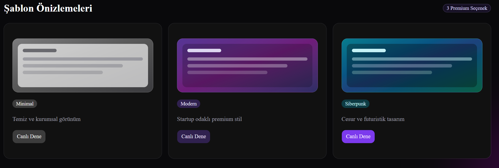

# 🚀 AI CV Builder

🇹🇷 Yapay zeka destekli modern CV ve portföy oluşturucu.  
🇬🇧 AI-powered modern resume and portfolio builder.

Create professional resumes and portfolios in minutes using artificial intelligence.

---

<p align="center">
  
</p>

<p align="center">
AI-powered modern CV & portfolio builder with AI features, live preview, premium templates, and PDF export.
</p>

---

## ✨ Features

### 🤖 AI-Powered Features

Boost your resume creation experience with built-in AI tools:

- Generate professional biographies
- Create LinkedIn summaries
- Improve project descriptions
- Get skill recommendations

---

### 🎨 3 Premium Templates

#### Minimal
Clean and corporate design focused on simplicity.

#### Modern
Premium startup-style modern interface.

#### Cyberpunk
Bold futuristic design with cyber aesthetics.

---

### ⚡ Live Preview

Instantly preview your CV while editing.

---

### 📄 One-Click PDF Export

Download your professional CV in PDF format with a single click.

---

### 🖼 Photo Upload Support

Add profile photos directly to your resume.

---

## 🛠 Tech Stack

- Next.js
- TypeScript
- Tailwind CSS
- AI Integration
- PDF Export System

---

## 🎯 Use Cases

Perfect for:

- Software Developers
- Students
- Freelancers
- Designers
- Startup Founders
- Job Seekers

---

## 🚀 Getting Started

### Clone the repository

```bash
git clone https://github.com/yourusername/ai-cv-builder.git
```

### Navigate into the project

```bash
cd ai-cv-builder
```

### Install dependencies

```bash
npm install
```

### Start development server

```bash
npm run dev
```

Open:

```bash
http://localhost:3000
```

---

## 🔥 Core Features Overview

| Feature | Description |
|---|---|
| AI Biography Generator | Creates professional bios instantly |
| LinkedIn Summary Generator | Generates optimized LinkedIn summaries |
| Project Description Enhancer | Improves project explanations |
| Skill Recommendation System | Suggests relevant skills |
| Live CV Preview | Real-time resume visualization |
| PDF Export | Download resume as PDF |
| Premium Templates | 3 modern CV themes |
| Photo Upload | Add profile image support |

---

## 📌 Future Improvements

- More resume templates
- Multi-language support
- AI interview preparation
- Online portfolio hosting
- Authentication system
- Cloud save support

---

## 🤝 Contributing

Contributions, feature requests, and feedback are welcome.

---

## 📄 License

This project is licensed under the MIT License.

---

## ⭐ Support

If you like this project, consider giving it a star on GitHub ⭐
